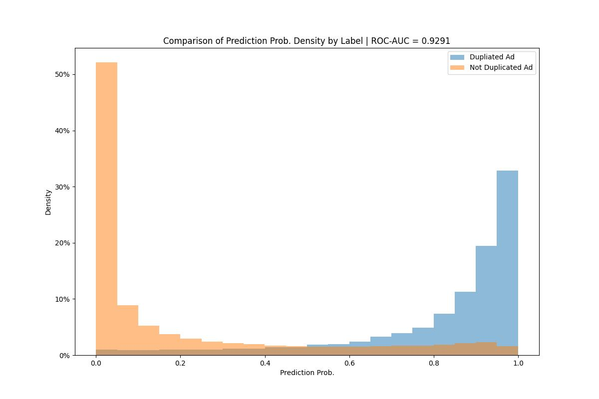

# Duplicate Detection Experiments Project
 ## Model Name: siamese_simple_bilstm

 * Open this [link](logs/siamese_simple_bilstm_general_auc_per_cat.html) for a detailed evaluation on dataset. 

  

 Experiment Specs: 

		Simple MulitLayer BiLSTM
		Using {title, desc, city, slug} features in encoder
		Using {bilstm} in encoder
		Using {mean} to aggregate embs in encoder
		Using {concat, fully-connected} for output

 Model Params: `{
  "text_max_length": 512,
  "text_embed_dim": 128,
  "text_num_layers": 2,
  "output_feature_dim": 296,
  "features_emb_dim": 20,
  "max_epochs": 5,
  "dropout_rate": 0.2,
  "batch_size": 256,
  "initial_lr": 0.001
}`

 Tokenizer Params: {'vocab_size': 40000}
