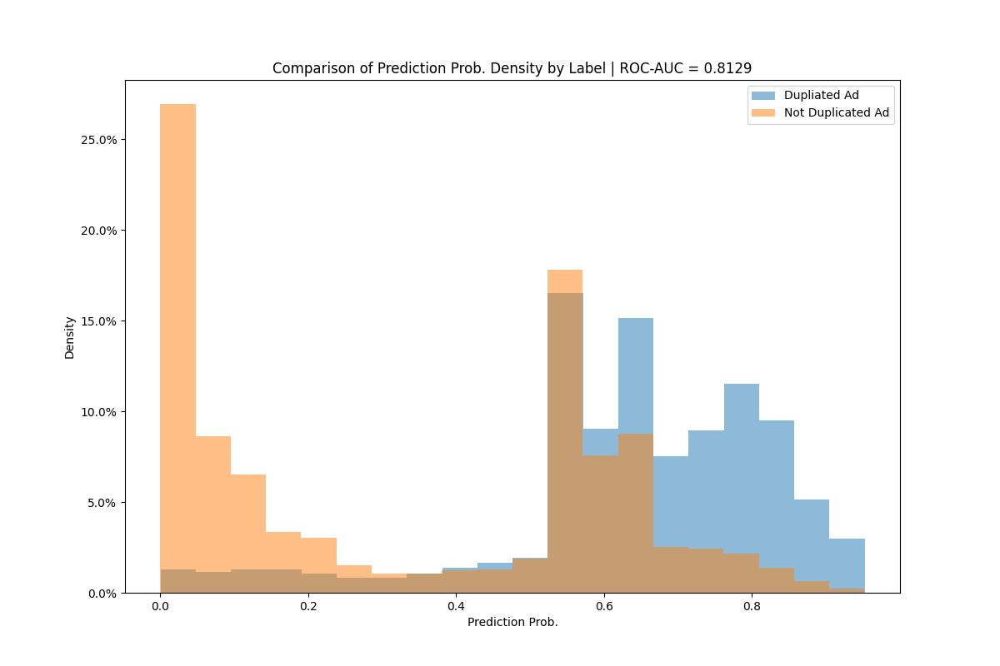

# Duplicate Detection Experiments Project
 ## Model Name: siamese_simple_transformer

 * Open this [link](logs/siamese_simple_transformer_general_auc_per_cat.html) for a detailed evaluation on dataset. 

  

 Experiment Specs: 

		Simple MulitLayer Transformer
		Using {title, desc, city, slug} features in encoder
		Using {transformer} in encoder
		Using {attention} to aggregate embs in encoder
		Using {subtract, concat, fully-connected} for output
		Retrain for 10 more epochs

 Model Params: `{
  "text_max_length": 512,
  "text_emb_dim": 128,
  "text_hidden_dim": 256,
  "text_num_layers": 2,
  "num_heads": 4,
  "output_feature_dim": 168,
  "features_emb_dim": 20,
  "max_epochs": 10,
  "dropout_rate": 0.2,
  "batch_size": 128,
  "initial_lr": 0.00012,
  "accumulate_grad_batches": 2,
  "checkpoint_path": "../../storage/models/siamese_simple_transformer_general_model-old.ckpt"
}`

 Tokenizer Params: {'vocab_size': 40000}
